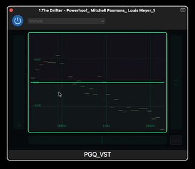

# ParaGraphiQ

**ParaGraphiQ** is an experimental graphic EQ plugin exploring a different way of interacting with an equalizer.

It provides **31 frequency bands** and a visual representation of the EQ response across **32 frequency-band positions**, allowing the equalization curve to be shaped directly through the graph.

## Why ParaGraphiQ?

Traditional graphic EQs and parametric EQs offer different ways of thinking about equalization.

ParaGraphiQ combines elements of both interaction approaches:

* **Graphic EQ:** directly draw and shape the overall EQ curve.
* **Parametric EQ:** select an individual frequency and manipulate it together with its surrounding frequencies.
* **Smoothness interaction:** control how strongly neighbouring frequencies follow a selected point or a drawn curve.

The result is an interaction model designed to make EQ adjustment more direct and intuitive, particularly on **touch-screen devices**.

The current version is a **VST prototype for desktop computers**. The longer-term goal is to refine the interaction model and integrate it into touch-screen audio applications.

## Try it

The project is currently experimental, and feedback is very welcome.

If you are interested in EQ interfaces, music technology, audio software, or touch-screen interaction, feel free to try ParaGraphiQ and let me know what you think.

In particular, I would be interested in hearing:

* Does the interaction feel intuitive?
* Does combining graphic and parametric-style interactions make sense?
* What would make the interface more useful on a touch screen?
* What would you change?

## Current status

ParaGraphiQ is an ongoing experiment rather than a finished product. The current release focuses on exploring the interaction concept and gathering feedback.

More developments are planned as the concept is tested and refined.

---

**ParaGraphiQ**
An experiment in making equalization more natural for touch-screen interaction.
